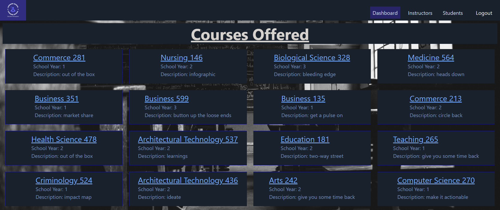

[](logo.png)

# LORRAINE SCHOOL

## By: ROY OKITE, TITUS MUTETI, RUTH WEKESA, ANGELA CHEPKOECH, ESTHER MAINA

## Project Description

This is a school management system designed for an admin to be able to view and modify the available courses, students and instructors. This was developed using a combination of react for the front-end section and rails for the backend.

The application was developed to meet the set project requirements:

- It is a single page application.
- It is Intuitive and has an easy to follow layout.
- It utilises pages and components for code organization and resusability.
- The application employs the use of client-side routing for page to page navigation.
- The project uses a Rails API backend with a React frontend.
- It has multiple resources on the backend, with full CRUD actions for at least one resource.
- CRUD actions for the student model.
- Authentication/authorization. At a minimum, a user should be able to log into the site and stay logged in via user ID in the session hash.
  <br />
  <br />

  

## Deliverables

The app utilizes a single HTML file, Tailwind CSS for styling and Javascript/JSX for interactivity. The backend utilizes rails for api data configuration as well as session handling and data validations.

A user is able to:

- View available courses from the school.
  <br /> <br />
  
  <br /> <br />
- View assigned instructors.
  <br /> <br />
  
  <br /> <br />
- View and modify enrolled students in the school.
  <br /> <br />
  
  <br /> <br />

## Setup Instructions

The project has been deployed and hosted on Render to the link [Lorraine School](https://lorraine-school.onrender.com) which is a unified cloud to build and run all your apps and websites with free TLS certificates, global CDN, private networks and auto deploys from Git.

On a local setting the frontend is linked to a API developed using Rails to feed it information stored using a postgresql database. <br />
Run npm start to run the client side. <br />
Run rails server to initialize the bakcend API. <br />
The foreman gem can be used to run both at the same time. <br />

### Closing

This project took a few days to design, implement and finally deploy. Throughout this development process we were able to acquire a greater understanding on design and coding fundamentals. Collaboration tools such as git also came in handy during the life cycle.

Sample code to control sessions when a user logs in:

```
class SessionsController < ApplicationController
    def create
        user = User.find_by(username: params[:username])
        if user&.authenticate(params[:password])
            session[:user_id] = user.id
            render json: user, status: :created
        else
            render json: { error: "Invalid username or password!"}, status: :unauthorized
        end
    end

    def destroy
        session.delete :user_id
        head :no_content
    end
end
```

All the information and resources used have been sourced from publicly available resources as well as the aforementioned API. This is a project aimed to train development by connecting the front-end skills learnt to the backend.

## This project aims to fulfill requirements for the Moringa School SD phase 4 project.
